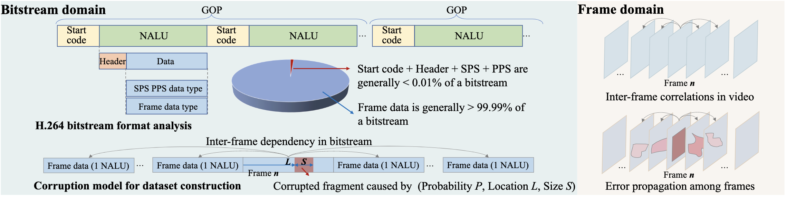
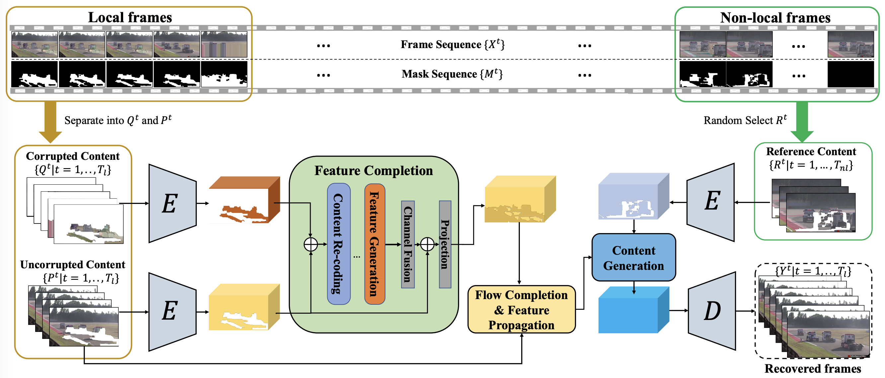
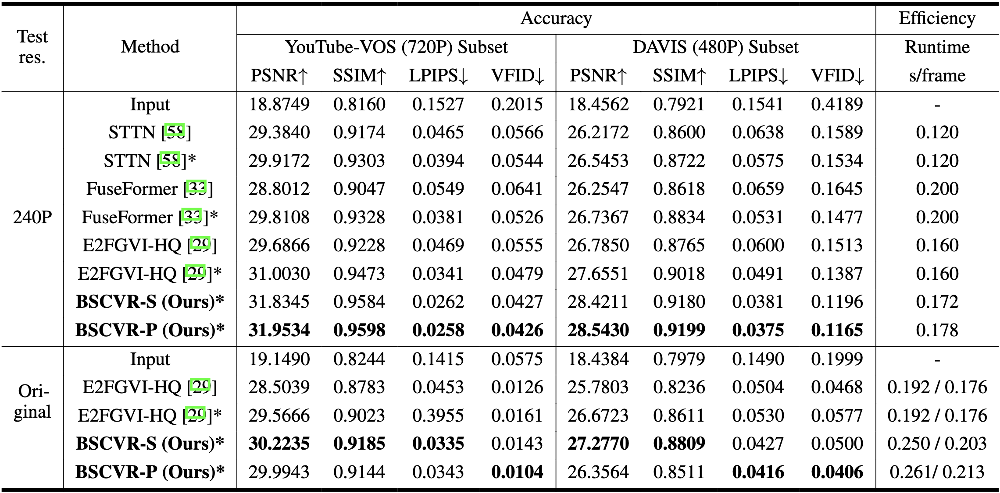

<div align="center">

<h1>BitStream-Corrupted Video Recovery:</br >A Novel Benchmark Dataset and Method</h1>

<div>
    <a href='' target='_blank'>Tianyi Liu*<sup>1</sup></a>&emsp;
    <a href='' target='_blank'>Kejun Wu*<sup>1</sup></a>&emsp;
    <a href='https://wangyintu.github.io/' target='_blank'>Yi Wang<sup>2</sup></a>&emsp;
    <a href='' target='_blank'>Wenyang Liu<sup>1</sup></a>&emsp;
    <a href='' target='_blank'>Kim-Hui Yap<sup>1</sup></a>&emsp;
    <a href='' target='_blank'>Lap-Pui Chau<sup>2</sup></a>
</div>
<div>
    <sup>1</sup>Nanyang Technological University&emsp;
    <sup>2</sup>The Hong Kong Polytechnic University
</div>

<div>
    <strong>NeurIPS 2023</strong>
</div>

<p align="center">
    <a href='https://arxiv.org/abs/2309.13890'>
      
    </a>
    <a href='https://proceedings.neurips.cc/paper_files/paper/2023/hash/d7928f6dfb0c30d6a6917587dacbe4bc-Abstract-Datasets_and_Benchmarks.html'>
      
    </a>
</p>

<p align="center"> (This page is under continuous update and construction..) </p>

---

</div>


## Update

**2023.12.18:** Our code and model are publicly available in the [method](https://github.com/LIUTIGHE/BSCV-Dataset/edit/main/README.md#824) part.

**2023.09.22:** 🎉 We are delight to announce that our paper has been accepted by **NeurIPS 2023** Dataset and Benchamrk Track, ~~we will upload the preprint version soon~~ the preprint version is available at [arXiv](https://arxiv.org/abs/2309.13890)!

**2023.08.30:** We additionally presented some performance comparisons in video form, which highlights the advantage of our method in recovering long-term and large area corruptions.

**2023.08.29:** We shared our proposed video recovery method and evaluation results in the [method](https://github.com/LIUTIGHE/BSCV-Dataset/edit/main/README.md#824) part. The training and testing code will release soon.

**2023.08.24:** **1).** New YouTube-VOS&DAVIS branches is available with tougher parameter adjustments and corruption ratios. **2).** New subset with higher resolutions in 1080P and 4K is included. **3).** H.265 protocol is supported.

## TODO
- [ ] Training scripts formatting, ~uploading~, and revision.
- [ ] Extended dataset, improved recovery method, and journal paper release.

## Table of Contents

- [Dataset](#dataset)
    - [Features](#features)
    - [Download & Extraction](#extraction)
    - [Extension](#extension)
- [Method](#method)

## Dataset


For each video in YouTubeVOS&DAVIS subset, under various parameter setting, we provide differently corrupted videos (from left to right: ``(P, L, S) = (1/16, 0.4, 2048), (1/16, 0.4, 4096), (1/16, 0.2, 4096), (2/16, 0.4, 4096)``, and **additional** ``(1/16, 0.4, 8192), (1/16, 0.8, 4096), (4/16, 0.4, 4096)`` branches , respectively. The explanation of the parameter will be explained below/in paper.).

<p align="center">
  
  
  
  
  
  
  
  
  
  
  
  
  
  
  
  
</p>

<!---
<div align="center">
<table>
  <tr>
    
    
    
    
  </tr>
</table>
<table>
  <tr>
    
    
    
    
  </tr>
</table>
<table>
  <tr>
    
    
    
    
  </tr>
</table>
<table>
  <tr>
    
    
    
    
  </tr>
</table>
--->

</div>

### Features
- Flexible video resolution setting (480P, 720P, 1080P, 4K)
- Realistic video degradation caused by bitstream corruption.
- Unpredictable error pattern in various degree.
- With about 30K video clips and 3.5M frames, 50% frames have corruption.
- ...

### Download & Extraction
**Dowload:** For dataset downloading, please check this [link](https://entuedu-my.sharepoint.com/:f:/g/personal/liut0038_e_ntu_edu_sg/Egn7Xygv7UJBilL9z3nFo_4Bm5LdeoXCv-uiDo3qANsmTw?e=fMU9gZ) (Extension for higher resolution, more parameter combination, and uploading are in progress).

**Extraction:** We have seperated the dataset into training and testing set and for each branch in YouTube-VOS & DAVIS.
YouTube-UGC 1080P subset and Videezy4K 4K subset is currently constructed for testing.
After downloading the ``.tar.gz`` files, please firstly restore the original ``.tar.gz`` files, unzipping the archives and formatting the folders by
```
$ bash format.sh
```

After the data preparation, ffmpeg encoded orignial (GT) video bitstream is provided in the ``_144096`` branch with folder name ``GT_h264`` and its decoded frame sequence with corruption is provided in the folder named ``GT_JPEGImages``.
We also provide the h264 bitstreams of each video and their decoded frame sequence as commonly used video dataset.
Additionally, the mask sequence which is used for corruption region indication is provided in the ``masks`` folder in each branch, the files are structured as following:
```
|- BSCV-Dataset
   |- scripts                             # Codes for dataset construction
   |- YouTube-VOS&DAVIS
     |- train_144096                      # Branch_144096
        |- GT_h264
           |- <video_id>.h264             # H.264 video bitstream with original id in YouTube-VOS dataset, 3,471 bitstream files in total
        |- BSC_h264                       # Corresponding corrupted bitstream
           |- <video_id>_2.h264 
        |- GT_JPEGImages
           |- <video_id>                  # Corresponding video ID
              |- 00000.jpg                # Decoded frame sequence with different length, 3,471 frame sequence folder in total                             
        |- BSC_JPEGImages                 # Corresponding decoded corrupted frame sequence
           |- <video_id>
              |- 00000.jpg              
        |- masks                          # Corresponding mask sequence
           |- <video_id>
              |- 00000.png      
        |- Diff                           # The binary difference map for mask geneartion
           |- < video_id>
              |- 00000.png
      |- train_142048                      # The following branch has the same structure, without GT data only
   |- YouTube-UGC-1080P
      |- FHD
         |- FHD_124096
            |- GT_h264       
            |- GT_JPEGImages
            |- BSC_h264
            |- BSC_JPEGImages
            |- masks
            |- Diff
   |- Videezy4K-4K
      |- QHD
         |- GT_h264       
         |- GT_JPEGImages
         |- BSC_h264
         |- BSC_JPEGImages
         |- masks       
         |- Diff
```

### Extension
We adopt FFmpeg as our video codec, please refer to the official guide line for your ffmpeg installation.

We proposed a parameter model for generating bitstream corruption and therefore causing arbitrarily corrupted videos, even additional branches. 


You can use the provided program with your parameter combination to generate arbitrary branches based on the GOP size 16 as our setting, by the following commands, e.g.
```
python corrpt_Gen.py --prob 1 --pos 0.4 --size 4096 
```
Please use integer for ``prob`` and ``size``, and float for ``pos`` due to the limitation of our current experimental setting. 
If you want to adjust the GOP size, please refer to FFmpeg's instruction to recoding the frame sequence in folder ``GT_JPEGImages`` of branch ``_144096``.

PS: It seems the working principle is different between Linux and Windows version of FFmpeg since we have some practical lost-frame error in decoding on Linux but the same bitstream is fine on Windows. So we recommend using FFmpeg on windows to deal with the lost frame issue if you are generating new branches. 

## Method

We propose a recovery framework based on end to end video inpainting method while leveraging the partial contents in the corrupted region, and we achieved better recovery quality compared with existing SOTA video inpainting methods.


## Experiments

### Dependencies and Installation
```bash
$ git clone https://github.com/LIUTIGHE/BSCV-Dataset.git
$ conda create -n BSCVR python=3.7
$ conda activate BSCVR
$ pip install torch==1.10.1+cu111 torchvision==0.11.2+cu111 -f https://download.pytorch.org/whl/cu111/torch_stable.html
$ pip install -r requirements.txt
```

### Prepare Pre-trained models
Download our pretrained models from this [link](https://entuedu-my.sharepoint.com/:f:/g/personal/liut0038_e_ntu_edu_sg/EvdxcFMZjsBDvWQxcXnj3AYBHDcVa5-jacK4szujTd6cqw?e=QfZgjX) to the ```/checkpoints``` folder.

### Quick Test
```bash
python test.py --width 854 --height 480 --type BSCVR_S --ckpt ./checkpoints/BSCVR_S.pth --video /path_to_frame_sequence --mask /path_to_mask_sequence --framestride 50
```
The results will be saved in the ```result``` foldedr, please indicate the width and height of the input video, and adjust ```--framestride``` to reduce the VRAM occupancy or improve inference efficiency.


### Dataset Processing for BSCVR Training
At current stage, we use the branch ```_144096``` for model training and please follow the steps below to process the dataset
1. Following the download instruction and save the .zip file for ```train_144096``` branch under the folder ```dataset/youtube-vos/```
2. Run ```sh datasets/zip_dir.sh``` (**Note:** please edit the folder path accordingly for GT and corrupted video files) for compressing each video in ```datasets/youtube-vos/BSC_JPEGImages``` and ```datasets/youtube-vos/GT_JPEGImages```.
The `datasets` directory structure will be arranged as: 
```
datasets
   |- youtube-vos
      |- BSC_JPEGImages
         |- <video_id>.zip
         |- <video_id>.zip
      |- GT_JPEGImages
         |- <video_id>.zip
         |- <video_id>.zip
      |- masks
         |- <video_id>
            |- 00000.png
            |- 00001.png
      |- train.json
   |- zip_file.sh
   |- Diff
   |- GT_h264
   |- 
```
3. Run the following command to train BSCVR
```
python train.py -c configs/train_bscvr_hq.json
```


## Results


More visualized performance comparisons of recovery results in video form are illustrated below

**Under 240P Resolution:** From left to right, top to down is Corrupted Video, Mask Input, STTN, FuseFormer, E2FGVI-HQ, BSCVR-S(Ours), BSCVR-P(Ours), and Ground Truth, in sequence.

<p align="left">
  
  
  
  
  
  
  
  
</p>

<!--
<p align="center">
  
  
  
  
  
  
  
  
</p>

<p align="center">
  
  
  
  
  
  
  
  
</p>
-->

**Under Original 480/720P Resolution:** From left to right, top to down is Corrupted Video, Mask Input, Ground Truth, Pretrained E2FGVI-HQ, BSCV-trained E2FGVI-HQ, BSCVR-S(Ours), in sequence.

<p align="left">
  
  
  
  
  
  
</p>

<!--
<p align="center">
  
  
  
  
  
  
</p>

<p align="center">
  
  
  
  
  
  
</p>
-->
---


## Citation
If you find our paper and/or code helpful, please consider citing:
```
@article{liu2023bitstream,
  title={Bitstream-Corrupted Video Recovery: A Novel Benchmark Dataset and Method},
  author={Liu, Tianyi and Wu, Kejun and Wang, Yi and Liu, Wenyang and Yap, Kim-Hui and Chau, Lap-Pui},
  journal={arXiv preprint arXiv:2309.13890},
  year={2023}
}
```

## Acknowledgement
This repository is maintained by Tianyi Liu, please feel free to contact me via `liut0038ATe.ntu.edu.sg`.

This code is based on [E2FGVI](https://github.com/MCG-NKU/E2FGVI/tree/master), thanks for their awesome work.

